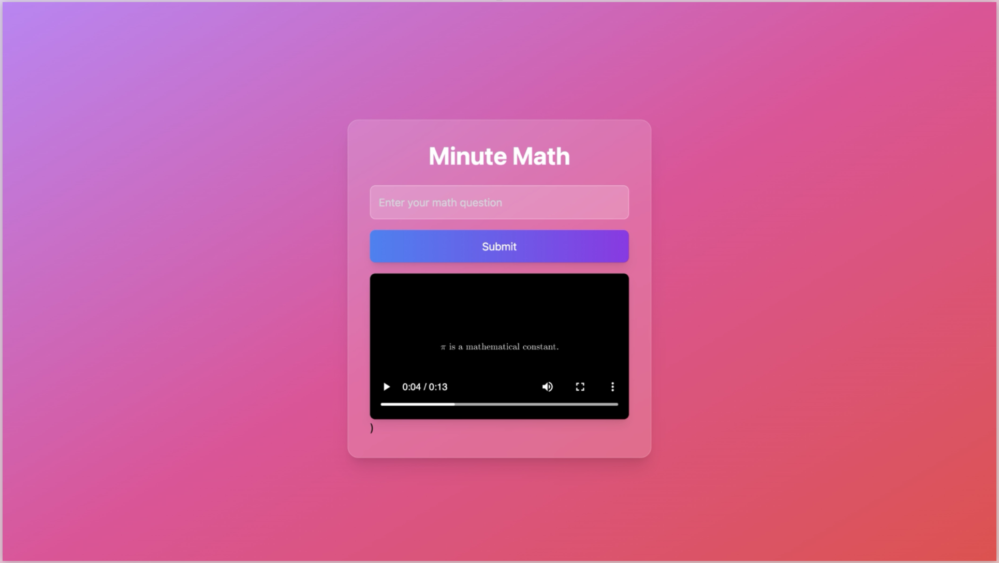

# Minute Math: AI-Powered Math Explanations

**Minute Math** is an innovative AI tool that simplifies complex math concepts by generating both video and audio explanations. With integrated API support, it provides a seamless experience for users looking to enhance their understanding.

- **Backend**: Python ( main.py ) with environment.yaml
- **Frontend**: Vite-powered engine in the `my-app` directory

**Stay tuned for more updates!**

